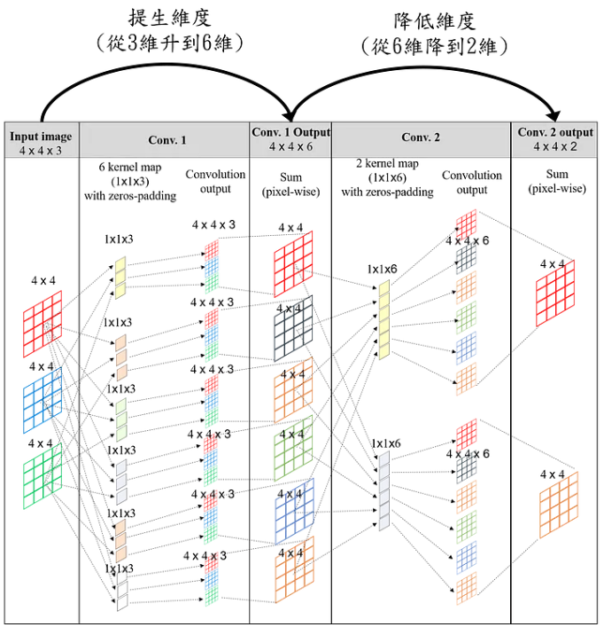
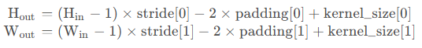

# 1. Conv Operation dim calculations

## 1.1 Conv operation
- inputs : N*N img
- Filter size : F*F 
- stride 
---
- output size : (N-F)/stride + 1 

- round down   
    e.g if output size = 27.5 -> 27
## 1.2 Conv with identical size

- We usually apply zero paddings to acheive this.
So, we need to set paddings by $(F-1)/2$, $F$ is odd  

- Example : 
    - Input : `32*32*3` img, 
    - Conv : `10 5*5` filters with `stride 1`, `pad 2`
    - Output size: `((32+2*2) - 5)/1 + 1 `
    - \# of parmas `5*5*3(volume) + 1(bias)` * `10(filter number)`

## 1.3 1*1 Convolution

- 基本上就是在做channel之間的合成 

## 1.4 Pooling Layer

- the Calculation formula for pooling layer is identical to conv layer but with same depth

- common settings `F=2, S=2` `F=3, S=2`

## 1.5 Transposed Convolution

- The Transposed Convolution is `not` the inverse of convolution 
- Mapping to a higher 